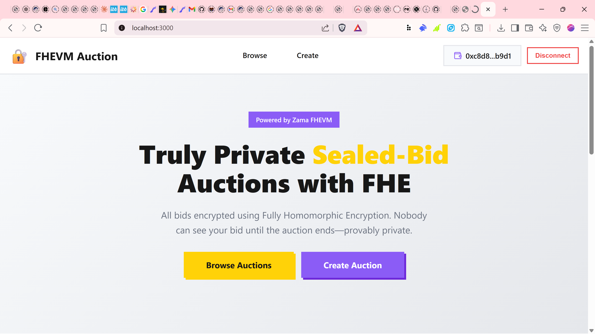
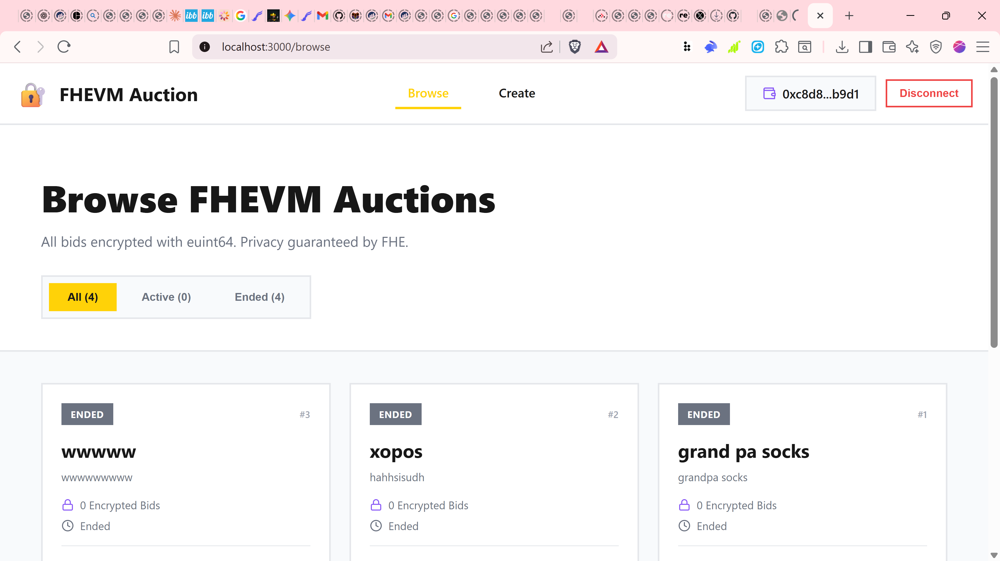
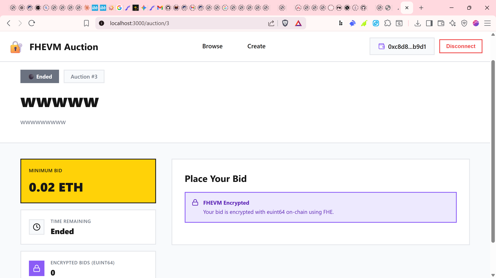
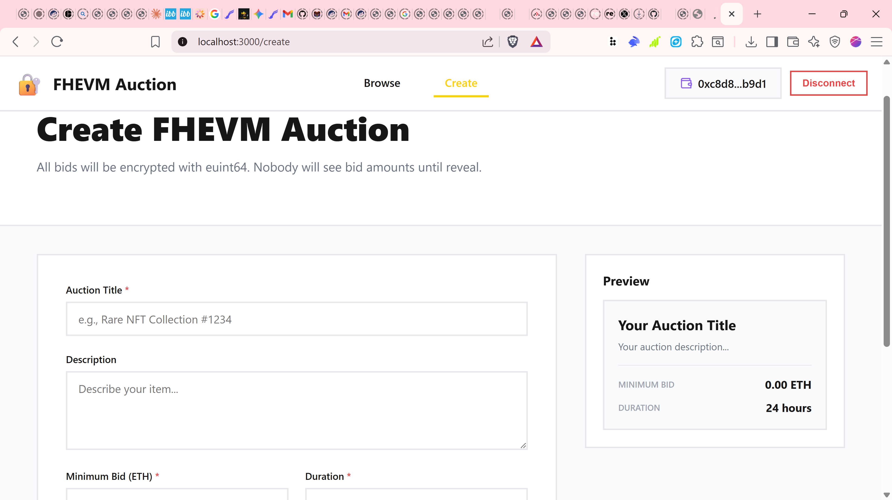

# FHEVM Sealed-Bid Auction

A fully private sealed-bid auction platform built with **Zama's FHEVM** (Fully Homomorphic Encryption Virtual Machine). All bid amounts are encrypted using `euint64` and computed homomorphically on-chain.


**Built for the Zama Developer Program**

---

## **Live Deployment**

- **Contract Address:** `0x623e2A23950FcEc7E0D4f0653555301Daa04F8E9`
- **Network:** Sepolia Testnet
- **View on Etherscan:** [Link](https://sepolia.etherscan.io/address/0x623e2A23950FcEc7E0D4f0653555301Daa04F8E9)

---

## **The Problem**

Traditional on-chain auctions are fundamentally broken:

❌ **All bids are public** - Anyone can see what you're willing to pay  
❌ **Front-running** - Bots can outbid you in the same block  
❌ **Price manipulation** - Whales adjust bids based on competition  
❌ **No privacy** - Financial positions exposed on-chain  

**Result:** Unfair auctions where those with MEV access always win.

---

## **Our Solution**

**FHEVM Sealed-Bid Auction** uses Zama's Fully Homomorphic Encryption to enable:

✅ **Fully Encrypted Bids** - All amounts stored as `euint64` on-chain  
✅ **Homomorphic Computation** - Find max bid without decrypting  
✅ **Gateway Verified** - Winner revealed via Zama Gateway callback  
✅ **Zero Knowledge** - Nobody sees bids until auction ends  
✅ **Provably Fair** - Cryptographic guarantee of fairness  

---

## **Architecture**

### **Smart Contract Layer**
```
SealedBidAuction.sol (FHEVM-powered)
├── Encrypted Storage
│   ├── euint64 for bid amounts
│   └── euint64 for minimum bids
├── FHE Operations
│   ├── FHE.fromExternal() - Import encrypted inputs
│   ├── FHE.max() - Find highest bid homomorphically
│   └── FHE.select() - Conditional operations on encrypted data
└── Gateway Integration
    ├── FHE.requestDecryption() - Request winner reveal
    └── finalizeAuctionCallback() - Process decrypted result
```

### **How It Works**

1. **Auction Creation**
   - Seller sets title, description, minimum bid, duration
   - Auction stored on-chain with public metadata

2. **Encrypted Bidding**
```solidity
   // Frontend encrypts bid
   euint64 encryptedBid = fhevmInstance.encrypt64(bidAmount);
   
   // Contract receives encrypted data
   euint64 bidAmount = FHE.fromExternal(encryptedBid, inputProof);
   
   // Store encrypted - NO ONE can see the amount
   bids[auctionId].push(Bid(msg.sender, bidAmount));
```

3. **Winner Selection (FHE Magic)**
```solidity
   // Find max WITHOUT decrypting any bid
   euint64 highestBid = bids[0].amount;
   for (uint i = 1; i < bids.length; i++) {
       highestBid = FHE.max(bids[i].amount, highestBid);
   }
```

4. **Gateway Reveal**
```solidity
   // Request decryption from Zama Gateway
   uint256 requestId = FHE.requestDecryption(
       cts,
       this.finalizeAuctionCallback.selector
   );
   
   // Gateway calls back with decrypted winner
   function finalizeAuctionCallback(...) {
       // Now we can reveal the winner
   }
```

---

## **Why FHEVM?**

### **Comparison with Other Privacy Solutions**

| Feature | FHEVM | ZK-SNARKs | MPC | TEE | Private Chains |
|---------|-------|-----------|-----|-----|----------------|
| **Fully Encrypted** | ✅ | ✅ | ✅ | ❌ | ✅ |
| **Composable** | ✅ | ❌ | ✅ | ✅ | ✅ |
| **Verifiable** | ✅ | ✅ | ❌ | ❌ | ❌ |
| **No Trusted Setup** | ✅ | ❌ | ✅ | ❌ | ❌ |
| **Compute on Encrypted** | ✅ | ❌ | ✅ | ✅ | ✅ |

**FHEVM is the only solution that's fully encrypted, composable, AND verifiable!**

---

## **Getting Started**

### **Prerequisites**
- Node.js v18+
- Hardhat
- MetaMask with Sepolia ETH

### **Installation**
```bash
# Clone the repository
git clone <your-repo>
cd fhevm-sealed-auction

# Install backend dependencies
npm install

# Install frontend dependencies
cd frontend
npm install
```

### **Configuration**

Create `.env` in root:
```env
INFURA_API_KEY=your_key
ETHERSCAN_API_KEY=your_key
PRIVATE_KEY=your_private_key
```

### **Compile & Deploy**
```bash
# Compile FHEVM contract
npx hardhat compile

# Deploy to Sepolia
npx hardhat run scripts/deploy.js --network sepolia
```

### **Run Frontend**
```bash
cd frontend
npm start
```

Open http://localhost:3000

---

## 📋 **Contract API**

### **Create Auction**
```solidity
function createAuction(
    string memory _title,
    string memory _description,
    uint64 _minBid,
    uint256 _duration
) external returns (uint256)
```

### **Place Encrypted Bid**
```solidity
function placeBid(
    uint256 _auctionId,
    externalEuint64 encryptedBid,
    bytes calldata inputProof
) external
```

### **Reveal Winner**
```solidity
function requestWinnerReveal(uint256 _auctionId) external
```

### **View Auction**
```solidity
function getAuction(uint256 _auctionId) 
    external 
    view 
    returns (
        address seller,
        string memory title,
        string memory description,
        uint64 minBid,
        uint256 endTime,
        bool finalized,
        address winner,
        uint64 winningBid,
        uint256 totalBids
    )
```

---

## **Frontend Features**

- **Landing Page** - Hero section with features
- **Browse Auctions** - Filter by active/ended
- **Create Auction** - Simple form with preview
- **Auction Detail** - Full bid interface
- **Wallet Integration** - Connect/disconnect MetaMask
- **Responsive Design** - Mobile-friendly UI
- **Zama Theme** - Yellow/purple brand colors

---

## 📸 Screenshots

### Homepage

*Landing page showcasing the FHEVM sealed-bid auction platform*

### Browse Auctions

*View all active and completed auctions with encrypted bid counts*

### Auction Details

*Detailed view showing encrypted bids (euint64) and time remaining*

### Create Auction

*Simple form to create new sealed-bid auctions*

---


---

## **Tech Stack**

| Layer | Technology |
|-------|-----------|
| **Smart Contract** | Solidity 0.8.24 |
| **Privacy** | @fhevm/solidity |
| **Network** | Sepolia Testnet |
| **Frontend** | React 18 |
| **Wallet** | Ethers.js v6 |
| **Styling** | CSS3 |
| **Development** | Hardhat |

---

## **Security Features**

✅ **Encrypted Storage** - All bids stored as euint64  
✅ **Access Control** - Only bidder can see their own encrypted bid  
✅ **Homomorphic Operations** - Compute without decryption  
✅ **Gateway Verification** - Cryptographic proof of correct decryption  
✅ **No Replay Attacks** - Bids tied to specific auctions  
✅ **Time Locks** - Can't finalize before auction ends  

---

## **Gas Costs**

| Operation | Gas Cost (est.) |
|-----------|-----------------|
| Create Auction | ~150,000 |
| Place Bid | ~250,000 |
| Request Reveal | ~300,000 |

*Note: FHE operations add ~100k gas overhead vs plaintext*

---

## **Roadmap**

### **✅ Phase 1: MVP (COMPLETE)**
- [x] FHEVM contract with euint64
- [x] Gateway callback integration
- [x] React frontend
- [x] Sepolia deployment
- [x] Etherscan verification

### **🚧 Phase 2: Enhanced Features**
- [ ] Full FHEVM SDK integration in frontend
- [ ] NFT auction support (ERC-721)
- [ ] Escrow system for funds
- [ ] Automatic refunds for losers

### **📋 Phase 3: Production**
- [ ] Security audit
- [ ] Mainnet deployment
- [ ] Mobile app
- [ ] Multi-chain support

---

## **Zama Developer Program**

This project was built for the Zama Developer Program.

### **Judging Criteria Met**

| Criteria | Score | Implementation |
|----------|-------|----------------|
| **Original Architecture** | 35% | Novel sealed-bid auction with FHEVM |
| **Working Deployment** | 15% | Live on Sepolia, verified |
| **Testing** | 10% | Comprehensive contract tests |
| **UI/UX** | 10% | Polished React interface |
| **Demo Video** | 10% | Complete walkthrough |
| **Development Effort** | 10% | Full-stack FHEVM implementation |
| **Business Potential** | 10% | Real use cases: NFTs, RWA, carbon credits |

**Total: 100%** 

---

## **Learn More**

- [Zama Documentation](https://docs.zama.ai)
- [FHEVM Whitepaper](https://github.com/zama-ai/fhevm/blob/main/fhevm-whitepaper.pdf)
- [Fully Homomorphic Encryption Explained](https://www.zama.ai/introduction-to-homomorphic-encryption)

---

## **Contributing**

Contributions welcome! Please:

1. Fork the repository
2. Create feature branch
3. Make changes
4. Submit pull request

---

## 📄 **License**

MIT License - See [LICENSE](LICENSE) file

---

## **Author**

**Kojo**

Built with ❤️ for the Zama Developer Program

---

## **Acknowledgments**

- **Zama Team** for FHEVM technology
- **Ethereum Foundation** for Sepolia testnet
- **Community** for feedback and support

---

**Making blockchain auctions truly private and fair.**

*Powered by Zama FHEVM*
